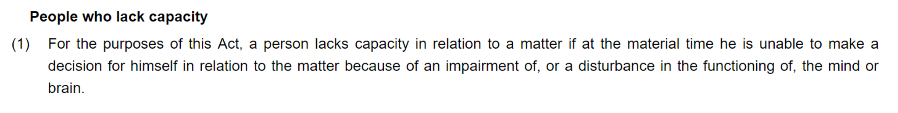
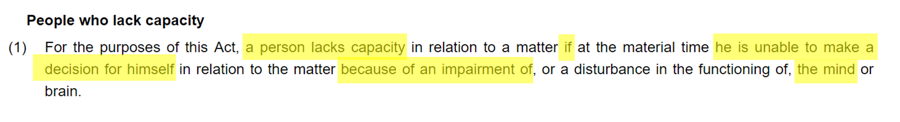
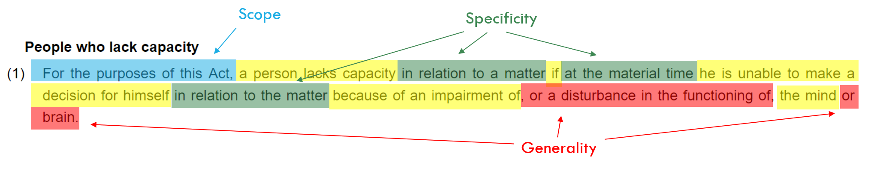
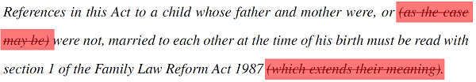
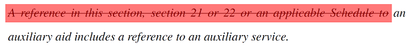
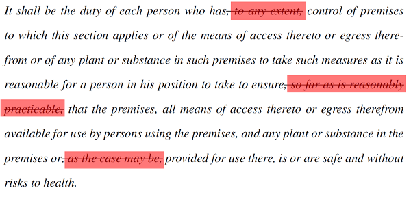
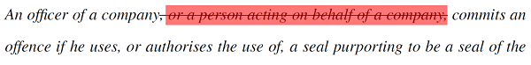
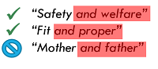
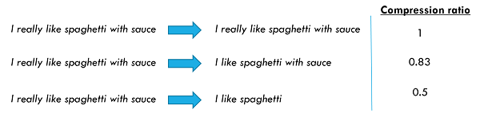

# Legal language compression

This repository contains the code, data and write-ups connected with my master's project: Sentence Compression for Improved Understanding of Legal Text. In addition to my thesis and viva slides, I have tried to highlight (and summarise) below the aspects of the project which might be most useful to others interested in legal language compression. 

Navigation:

 - [Motivation](https://github.com/richardbatstone/legal_language_compression#Motivation)
 - [Approach](https://github.com/richardbatstone/legal_language_compression#Approach)
 - [Data](https://github.com/richardbatstone/legal_language_compression#Data)
 - [Simplification themes](https://github.com/richardbatstone/legal_language_compression#Simplification-themes)
 - [Transfer learning](https://github.com/richardbatstone/legal_language_compression#Transfer-learning)
 - [Rules-based model](https://github.com/richardbatstone/legal_language_compression#Rules-based-model)
 - [Results and observations](https://github.com/richardbatstone/legal_language_compression#Results-and-observations)
 - [Code and data list](https://github.com/richardbatstone/legal_language_compression#Code-and-data-list)

## Motivation

The project is motivated by a desire to improve how law is communicated. It starts from the position that people *should* be able to understand the laws that govern their lives and observes that, in general, people struggle to understand law. Lots of thinking has been done on this topic and I happily draw on previous work. For example:

 - [Curtotti and McCreath's work](https://ojs.law.cornell.edu/index.php/joal/article/view/16) examining the relationship between wider access to law (through digitisation) and general understanding of law; and
 - [the work of the Office of the Parliamentary Counsel](https://www.gov.uk/government/publications/when-laws-become-too-complex) into the causes of complexity in legislation.

One of the causes of poor understanding of law (specifically, legislation) that emerges from this work is that the language, style and structure of legislation is not 'user-friendly'. Certainly, the clarity and accessibility of the language used to express our laws has improved in recent decades. But a cursory glance at legislation entering the statute book gives an indication of the level of complexity that remains.

I argue that this complexity arises from a fundamental tension in legislative drafting: legislation has to speak to many different audiences, and those audiences have different needs.

 - ordinary readers wish to understand the high-level impact of a rule (but only as it applies to their circumstances);
 - administrators and lawyers demand precision and certainty (regardless of the cost to readability); and
 - legislators wish to see a clear articulation of their policy objectives (with less regard to the interaction with the complex body of rules of which their legislation is a part).
 
Rather than attempting to cater to all of these audiences at the same time (through changes to drafting practices) I wanted to explore whether it's possible to build "simplification" models to automatically simplify legislative language with the aim of providing a "view" of legislation more suitable to an ordinary person's needs.

(N.B. my project explores improving the communication of law through computational methods, but this represents one small part of the toolbox that might be brought to bear on the problem. For example, [design processes and principles](http://www.lawbydesign.co/en/home/) might inform how law is presented and the style of supporting materials.)

## Approach

I explore simplification through compression. The aim of a compression system is, given an input text, to return a simplified version of that text. The compression is achieved by removing words from the original. For example, consider the extract from the Mental Capacity Act 2005 below.

This provision, a single sentence comprising 50 words written in the passive voice, is not very 'readable'. But breaking down the sentence, I suggest a decent summary of the provision is provided by the words highlighted yellow:

If the core meaning of the provision is captured by these words you might ask why we need the rest of the words. The answer comes back to the tension mentioned above: in some circumstances, and for some audiences, these extra words are crucial. They add precision, but at the expense of readability.

 
The aim of the compression system is to automatically return the words highlighted yellow and delete the rest: compression by deletion. This type of system is inherently more limited that a general simplification system. There are only certain deletions that can be made if the output is to remain grammatically valid. And the system can't do any paraphrasing or lexical substitution to increase the readability of the output (it can't, for example, re-write a sentence in the active voice). However, general purpose simplification systems are *really* hard to build, so starting with compression by deletion seems sensible.

I develop a few different models to carry out automatic compression (by deletion) of legal language:

 - a rules-based system which compresses legal text through a combination of removing particular syntactic sub-trees and phrase matching a set of patterns;
 - a statistical system using LSTMs; and
 - a statistical system based on Transformers.
 
The rules-based model is summarised below. If you are interested in the statistical model setup, go to page 35 of my thesis for full details. In brief, the approach is to treat the problem as a sequence-to-sequence task where the input is the uncompressed text and the output is a sequence of 1s and 0s, indicating whether the corresponding word is to be retained or deleted. The code for these different systems is also included in this repository but, ultimately, I didn't think any of these systems performed compellingly enough to turn them into production versions. Therefore, they are quite rough around the edges.

## Data

The fuel for statistical systems is data. The key data sources I used in the project are:

 - a corpus of 200,000 compressed and uncompressed sentence pairs drawn from news headlines and the associated news articles, compiled by Filippova and others: https://github.com/google-research-datasets/sentence-compression
 - a corpus of 1,000 compressed and uncompressed sentence pairs drawn from legislation, constructed for the purpose of the project and included in this repository.
 
The legislative compressions have some quirks. For example, unlike the news headline compressions, not all of the examples are syntactically complete sentences. That's because, in legislation, single sentences can stretch across multiple sub-sections, often running to a very large number of words. I think it's useful to be able to deal with this language at the sub-section level, so the legislative compression includes entries like:

**Original text** | **Compressed text** | **Fragment**
---|---|---
Case 4 is where- (a) R requests, agrees to receive or accepts a financial or other advantage, and (b) the request, agreement or acceptance itself constitutes the improper performance by R of a relevant function or activity | Case 4 is where- (a) R accepts a financial or other advantage, and (b) the acceptance itself constitutes the improper performance by R of a relevant function | No
R requests, agrees to receive or accepts a financial or other advantage, and | R accepts a financial or other advantage, and | Yes
the request, agreement or acceptance itself constitutes the improper performance by R of a relevant function or activity | the acceptance itself constitutes the improper performance by R of a relevant function | Yes

Where "Fragment" indicates whether the example is a sentence or not. Page 29 onwards of my thesis describes the construction of the corpus, its data structure and statistics.

## Simplification themes

When I was putting the legislative compressions together, I (perhaps foolishly) didn't have any particular rules or approaches to constructing the compressions in mind. However, as I went through the exercise some themes emerged and, if I had my time again, I would spend more time trying to systematise these themes and link them to the rules-based compression system.

As it is, the simplification themes I thought about were:

 - removal of synonymous or hyponymous words and concepts;
 - removal of reference words and phrases where the reference can be assumed from the context; and
 - removal of other extraneous information.
 
### Synonymy and hyponymy

Precision (and generality) in legal language often leads to listing multiple concepts where, in non-legal language, a single concept would do. For example, consider the Bribery Act 2010 provision from above:

> R requests, agrees to receive or accepts a financial or other advantage

The provision describes the circumstances in which R might commit bribery. The relevant actions "requests", "agrees to receive" and "accepts" are closely related (if not quite synonyms). For legislative purposes, it's important that all these words are present. From an ordinary person's perspective, I suggest the following will do:

> R ~~requests, agrees to receive or~~ accepts a financial or other advantage

Interestingly, making these sorts of deletions can also help language parsers construct more accurate dependency parses (just try putting these two fragments into [spaCy](https://explosion.ai/demos/displacy)).

### Context assumptions

Another feature of legislative language is that facts or circumstances which, in non-legal language, would usually be assumed are, in legal rules, made explicit. For example, from the Children's Act 1989:

> Where a child's father and mother were married to each other at the time of his birth, they shall each have parental responsibility for the child.

The requirement that the father and mother be married *to each other* before they automatically assume responsibility for the child is important from a rule-drafting perspective: a child's parents might be married to other people at the time of his birth and, in that circumstance, different rules should apply. However, I suggest, in this context, most people will assume "married at the time of his birth" *means* "married to each other". (Though happy to be called on my nuclear family world experience.)

### Extraneous information

Finally, a lot of legislative language is purely mechanical. The language is important from a rule-making perspective but most ordinary readers will find the information irrelevant, or lack the domain knowledge to understand its purpose. The latter is probably worse because readers waste time trying to work out if the language is important or not. For example, from the Academies Act 2010:

> The Academy is to be treated, on the conversion date, as designated by order under section 69(3) of SSFA 1998 as an independent school having that religious character.

The provision is describing how a religious school should be treated when it is converted into an Academy. I suggest that, in terms of conveying the key meaning, the reference to "designation by order under the SSFA" is irrelevant and an appropriate summary might be:

> The Academy is to be treated, on the conversion date, ~~as designated by order under section 69(3) of SSFA 1998~~ as an independent school having that religious character.

## Transfer learning

A core part of applying statistical systems to legal language is understanding *transfer learning*. Statistical systems are built by applying algorithms to large amounts of training data. For example, we might have a few hundred thousand pairs of compressed and uncompressed sentences. The algorithm's job is to learn a mapping between the compressed and uncompressed examples that can then be applied to new sentences. Why do we need so many examples? Because the "map" that we want our algorithm to learn is hugely complex and, if we want it to generalise well, we need lots of data points for the algorithm to draw on to build the map.

This need for lots of data has been a barrier to developing NLP systems for law: there just isn't much processed ("labelled") legal data for developers to work with. There isn't, for example, any corpus of hundreds of thousands of compressed and uncompressed legal sentences.

That's where transfer learning comes in. In transfer learning we attempt to leverage knowledge about some related task or domain where much more data is available and apply that knowledge to our task. In NLP I think about this in terms of implicit and explicit transfer learning, but look at [Sebastian Ruder's](https://ruder.io/thesis/) work for a deeper understanding.

 - **Implicit transfer learning**: tries to provide the system with general information about language. For example, rather than starting from scratch and expecting the system to learn about vocab and grammar rules, this information is learnt from a different (bigger) language corpus and provided to the model to use as a starting point.
 
 - **Explicit transfer learning**: tries to provide the system with general information about the task. For example, if I have a large number of compressed and uncompressed pairs of sentences from ordinary language, I could start by training the model on those examples and then show it my (small number of) legal examples in the hope that some of the things it learnt about ordinary language transfer to legal language.
 
Generally, transfer learning hasn't worked very well in NLP, particularly where the task you are trying to solve involves language that looks very different to ordinary language (like law - see page 28 of my thesis for some statistics on how legal language differs from ordinary language). However, a number of advances in transfer learning in recent years show some promise (in particular, NLP specific fine-tuning procedures and the introduction of large scale language models). So I thought it was worth a go.

In my project, implicit transfer learning takes the form of word2vec embeddings and BERT (the pre-trained language model). Explicit transfer learning takes the form of training on the news healing corpus. I tried training the simplification models in a multiple different ways to look at the effects of transfer learning, including:

 - LSTM model (encoder/decoder with fixed word2vec inputs) trained only on the news headline corpus;
 - LSTM model trained on the news headline corpus and 'fine-tuned' on the legislative corpus;
 - LSTM model trained on the news headline corpus and 'fine-tuned' using the [ULMFiT](https://arxiv.org/abs/1801.06146) procedure;
 - LSTM model trained only on the legislative corpus;
 - BERT model (transformer encoder/decoder with BERT as the encoder, all parameters updated during training) trained only of the news headline corpus;
 - BERT model trained on the news headline corpus and 'fine-tuned' on the legislative corpus; and
 - BERT model trained only on the legislative corpus.
 
As mentioned above, I also developed a rules-based model and experimented with combining it with the statistical models.

## Rules-based model

I wanted to see how far I could get with a quick and dirty rules-based model. It turns out you can get a fair way and, sometimes, the results are quite compelling.

The rules-based model has 5 types of rules for determining what words to remove from inputs. The following are removed:

1. Text in parentheses: Language within parentheses is, by construction, often parenthetical to the main content of the sentence.

2. Certain syntactic sub-trees: For example, sub-trees beginning "A reference to..." are removed, as this type of language can often be inferred from context.

3. Common extraneous legal phrases: For example, caveats and prepositional phrases that don't contribute to a high-level understanding of the text, such as "so far as is reasonably practicable" or "as the case may be".

4. Certain alternative sub-clauses: For example, where the first word of the sub-clause is "or" and the final word is the same as the word immediately preceding the sub-clause (a fairly common legal pattern).

5. Doublets: single concepts expressed as conjunctions of two near synonymous concepts to ensure generality. (Doublets are identified by matching "X and Y" patterns and compressing those patterns where the similarity between the word embeddings for X and Y is sufficiently high. The word embeddings are taken from spaCy's in-built 'Glove' vectors. The similarity threshold is set by trial and error. Even so, this rule is the least precise of the rules described as word embedding similarity does not necessarily imply synonymy. For example, the word embeddings for "mother" and "father" are similar, but they cannot be treated as synonyms in a legislative context).

See page 37 of my thesis for more details.
 
## Results and observations

The performance of the different models have to be seen through the lens of their relative *compression ratios*: the average degree of compression applied by the model. Different compression ratios are illustrated below.

It only makes sense to compare models which generate similar compression ratios (though, of course, we can also comment on the appropriateness of generated compression ratio - did the model tend to delete too much or not enough?).

A number of examples from the different models are set out in my viva slides (slide 77 onwards). The top performing models are:

1. the rule-based model, which achieves a compression ratio of 0.90, and an F1 score of 0.77;
2. the BERT and rule-based ensemble model trained only on the legislative corpus, which achieves a compression ratio of 0.72 (closest to the target ratio of 0.63), and an F1 score of 0.57; and
3. the BERT and rule-based ensemble model pre-trained on the news headline corpus before being fine-tuned on the legislative corpus, which achieves a compression ratio of 0.39, and an F1 score of 0.42.

### Observations and future work

 - **Effectiveness of implicit transfer learning**: There was little difference between the LSTM and BERT "base" models (the models that were trained on the news headline corpus only). That was surprising as I expected the BERT model (with all its millions of parameters) to perform better. However, comparing the LSTM and BERT models that were trained *only* on the legislative corpus, the LSTM model collapsed whilst the BERT model was still able to perform. So the depth of the BERT language model does have an edge over the word2vec embeddings, but the advantage largely disappears by the time the pre-training task is introduced.
 
 - **Effectiveness of explicit transfer learning**: As identified above, pre-training on the news headline corpus was essential for the LSTM models (without it, the models collapsed). However, it wasn't that effective overall: (i) there was little difference between the LSTM model using ordinary fine-tuning and the LSTM model using the ULMFiT procedure; and (ii) the model with the compression ratio closest to the target (the BERT and rules-based ensemble model trained only on the legislative corpus) didn't use the pre-training task at all. Taken together, this suggests there is too great a difference between the source domain (news articles) and task (compression of sentences) and the target domain (legislation) and target task (compression of sentences and fragments).

There're a few ways the work could be developed:

1. Expand the legislative corpus: we could probably improve the model by increasing the size of the legislative corpus.
2. Augment the pre-training task: the news corpus compressions have, on average, a lower compression ratio than the legislative compressions. We could try improving the usefulness of the pre-training task by sub-selecting examples with higher compression ratios.
3. Develop a legal domain language model: rather than using a language model derived from ordinary language, we could try building a legal language model.
4. Focus on smarter rule-based models: we could develop the rules-based model, adding more complexity (perhaps looking for simplification patterns across whole sections/parts).

Of these, I think 3. has the potential to provide the most use to the most number of applications in the legal domain. I suspect 4. is, in the short term, the most likely way of developing a simplification system for use in production.

# Code and data list

### data/

#### data/raw_data

**File** | **Description**
---|---
data_split.ipynb | Script for splitting the raw (legislative) data into training, validation and test sets
leg_targetted_train_data.pickle | 'Targetted' sub-set of training data
leg_targetted_val_data.pickle | 'Targetted' sub-set of validation data
leg_test_data.pickle | Test data
leg_train_data.pickle | Training data
leg_val_data.pickle | Validation data
legislative_compressions_tsv | Raw corpus

#### data/BERT_parsed_data

**File** | **Description**
---|---
BERT_data_prep.ipynb | Script for preparing data for BERT input
leg_targetted_train_data_128_TFR | BERT input, 'targetted' sub-set of legislative training data
leg_targetted_val_data_128_TFR | BERT input, 'targetted' sub-set of legislative validation data
leg_test_data_128_TFR | BERT input, legislative test data
leg_train_data_128_TFR | BERT input, legislative training data
leg_val_data_128_TFR | BERT input, legislative validation data

#### data/LSTM_parsed_data

**File** | **Description**
---|---
LSTM_data_prep.ipynb | Script for preparing data for LSTM input
leg_embeddings* | Vocabulary and associated word2vec embeddings for the legislative input text
leg_test* | Legislative test data: labels, original text, spaCy parsed text and vocabulary
leg_train* | Legislative training data: labels, original text, spaCy parsed text and vocabulary
leg_train_targetted* | 'Targetted' sub-set of legislative training data: labels, original text, spaCy parsed text and vocabulary
leg_val* | Legislative validation data: labels, original text, spaCy parsed text and vocabulary
leg_val_targetted* | 'Targetted' sub-set of legislative validation data: labels, original text, spaCy parsed text and vocabulary
total_vocab | Total legislative dataset vocabulary

### models/

#### models/LSTM_models

The LSTM models are quite large (each in excess of 100MB) and instead of hosting them on GitHub, they are hosted in a publically accessible Google Storage Bucket:

- LSTM_base (<https://console.cloud.google.com/storage/browser/rob-bert-legal-compression-public/public/LSTM_base>)
- LSTM_leg_only (<https://console.cloud.google.com/storage/browser/rob-bert-legal-compression-public/public/LSTM_leg_only>)
- LSTM_transfer (<https://console.cloud.google.com/storage/browser/rob-bert-legal-compression-public/public/LSTM_transfer>)
- LSTM_ULMFiT (<https://console.cloud.google.com/storage/browser/rob-bert-legal-compression-public/public/LSTM_ulmfit>)

**File** | **Description**
---|---
model_test_script.ipynb | Script for testing the LSTM models
model_train_script.ipynb | Script for training the LSTM models
model_ulmfit_script.ipynb | Script imlpementing transfer learning using the ULMFiT procedures

#### models/Rules_models

**File** | **Description**
---|---
BERT_prep.py | A helper module for preparing BERT inputs as part of the BERT_rules_ensemble model
rule_transformations.py | The rule transformations implemented in the rules based model
rules_BERT_script.ipynb | A helper script for preparing BERT inputs as part of the BERT_rules_ensemble model
rules_only_script.ipynb | Script for running the rules based model

#### models/BERT_models

The BERT models are quite large (each in excess of 1GB) and instead of hosting them on GitHub, they are hosted in a publically accessible Google Storage Bucket:

- BERT_base (<https://console.cloud.google.com/storage/browser/rob-bert-legal-compression-public/public/bert_base>)
- BERT_transfer (<https://console.cloud.google.com/storage/browser/rob-bert-legal-compression-public/public/bert_transfer>)
- BERT_leg_only (<https://console.cloud.google.com/storage/browser/rob-bert-legal-compression-public/public/bert_leg_only>)
- BERT_rules (<https://console.cloud.google.com/storage/browser/rob-bert-legal-compression-public/public/bert_rules>)
- BERT_rules_leg_only (<https://console.cloud.google.com/storage/browser/rob-bert-legal-compression-public/public/bert_rules_leg_only>)

**File** | **Description**
---|---
model_run_script.ipynb | Script for training and testing the BERT models (designed to be run on Google Colaboratory)
beam_search.py | Beam search module for BERT models
model.py | Main decoder transformer model

### evaluation/

**File** | **Description**
---|---
BERT_reconstruct.py | A module to reconstruct the outputs from the BERT models
BLEU.ipynb | Script for calculating the BLEU evaluation metric
LSTM_reconstruct.py | A module to reconstruct the outputs from the LSTM models
PrecisionRecall.ipynb | Script for calculating precision, recall, F1, compression ratio and string-for-string match
ROUGE.ipynb | Script for calculating the ROUGE evaluation metric
SARI.ipynb | Script for calculating the SARI evaluation metric
SARI.py | Underlying module for SARI calculation

#### evaluation/results

**File** | **Description**
---|---
BERT_base.pickle | Test results for the BERT base model
BERT_leg_only.pickle | Test results for the BERT leg only model
BERT_rules.pickle | Test results for the BERT rules ensemble model (with pre-training)
BERT_rules_leg_only.pickle | Test results for the BERT rules ensemble model (without pre-training)
BERT_transfer.pickle | Test results for the BERT transfer model
LSTM_base.pickle | Test results for the LSTM base model
LSTM_leg_only.pickle | Test results for the LSTM leg only model
LSTM_transfer.pickle | Test results for the LSTM transfer model
LSTM_ulmfit.pickle |Test results for the LSTM ULMFiT model
Rules.pickle | Test results for the rules based model

#### evaluation/extrinsic

**File** | **Description**
---|---
compressed_legislation.docx | Compressed legislation generated by 'BERT_rules_leg_only model' for extrinsic evaluation task
QA_responses.docx | The responses to the comprehension questions generated by the 'cape' QA model for both compressed and uncompressed legislation
uncompressed_legislation.docx | Uncompressed legislation for extrinsic evaluation task

The original surveys can be accessed here:

- <https://docs.google.com/forms/d/e/1FAIpQLSceEYbnpHR3K8y1PVMJ3dxlTwvOsGIE2hQN0hchbr-QC34xLw/viewform?usp=sf_link>
- <https://docs.google.com/forms/d/e/1FAIpQLSfZG7DKNoa1-A_ZNo6g6MIiHOiucf1nurWwAy2DJs_UQe5qwg/viewform?usp=sf_link>
